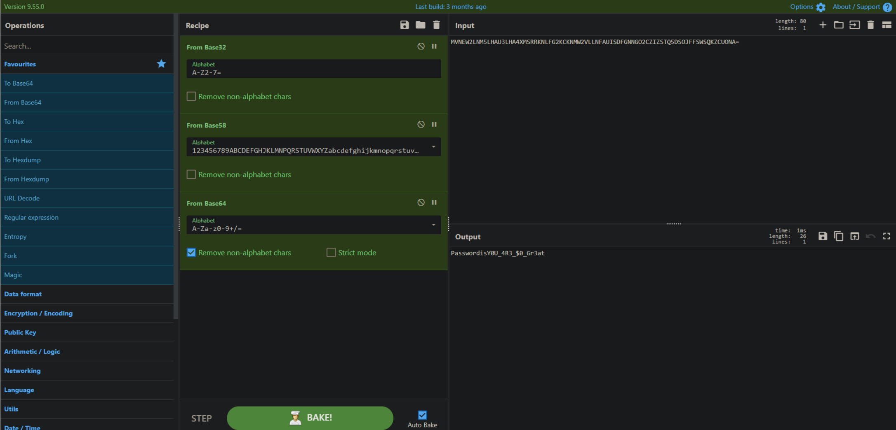

# Misc——Citanul的大秘宝WP

**flag：zjnuctf{7abe404919c927b3dc71b93102227389}**

```bash
#步骤一
首先该压缩包的密码是A1na#
SHA2-256加密算法加密后的结果是08af717376f7f71b9525f4f76fb0bfc8b12a210a5653e87989bf7f46e96640c6
解法一：直接用Advanced Archive Password Recovery限制长度爆破压缩包密码（几秒就出了）
解法二：用hashcat爆破（也是秒出）
hashcat --custom-charset1 ?d?l?u?s -a 3 -m 1400 08af717376f7f71b9525f4f76fb0bfc8b12a210a5653e87989bf7f46e96640c6 ?1?1?1?1?1
非预期解：CMD5加钱购买
```

```bash
#步骤二
压缩包开出来有一个加密的word还有一个MP3Stego隐写过的mp3文件
可以大胆猜测word的密码就藏在在这个mp3文件中
使用MP3Stego破解出隐写的文本（这里的这个MP3Stego是没有密码的，要输入密码时直接回车就行）
```

```bash
#步骤三
MP3stego Decode后得到一段base混合编码后的密文
#加密过程如下
明文：PasswordisY0U_4R3_$0_Gr3at
base64：UGFzc3dvcmRpc1kwVV80UjNfJDBfR3IzYXQ=
base58:eZKimgVpSk89vJ1SVSiBSYmUkiADHe3ZghYFe8trrJYZPVEG4
base32:MVNEW2LNM5LHAU3LHA4XMSRRKNLFG2KCKNMW2VLLNFAUISDFGNNGO2CZIZSTQ5DSOJFFSWSQKZCUONA=
#随波逐流应该是出不来的，用CyberChef中的magic或者ciphey都是秒出（这里ciphey可能有点问题，把下划线自动删去了，还是建议用CyberChef）
```




```bash
#步骤四
得到word的密码后打开word
前面的背景知识仅作了解即可，主要是要看后面的两段数据
3460转为十六进制后是0x0D84
4230转为十六进制后是0x1086
可见表示余额的十六进制数据是小端序存储的，然后很明显最后一位就是校验位
这里可能需要一点点的经验、尝试和猜测了
0x0D+0x84-0x15=0x7C
0x10+0x86-0x1A=0x7C
所以我们到这里就知道最后一位校验位是怎么生成的了
所以当余额为600时，这一行的数据就是
60EA00000000160B1A0832030C0000CE
所以最后的flag就是：zjnuctf{7abe404919c927b3dc71b93102227389}
```

```bash
#后来加的Hint
Hint就在这里，但是你看不见.txt 这个文件考察的是零宽字符，直接在线网站解密即可
```


