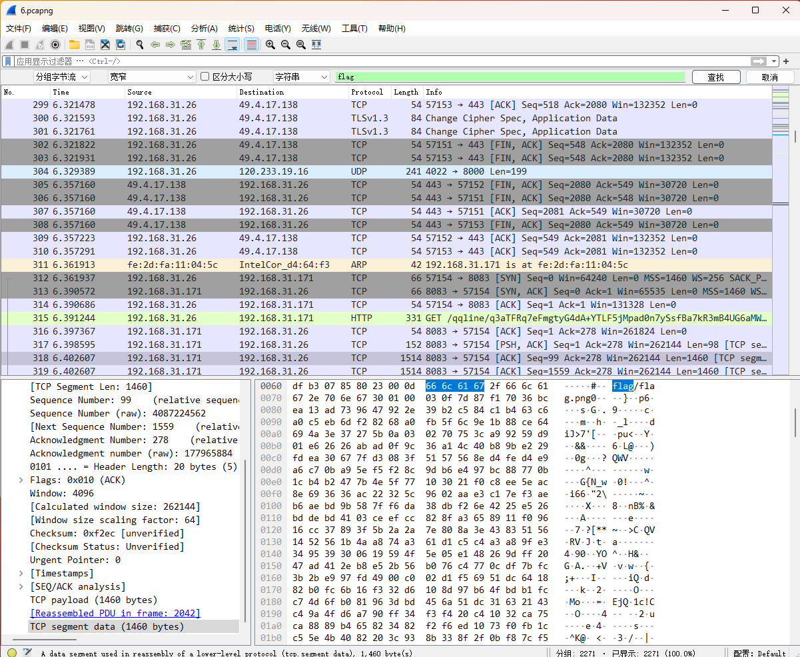
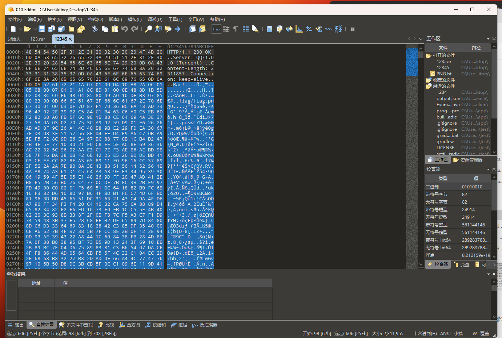
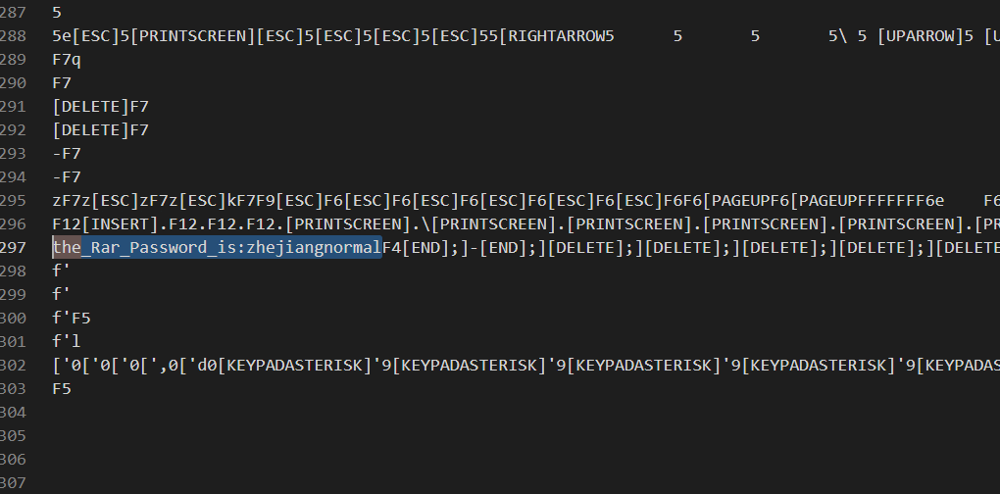
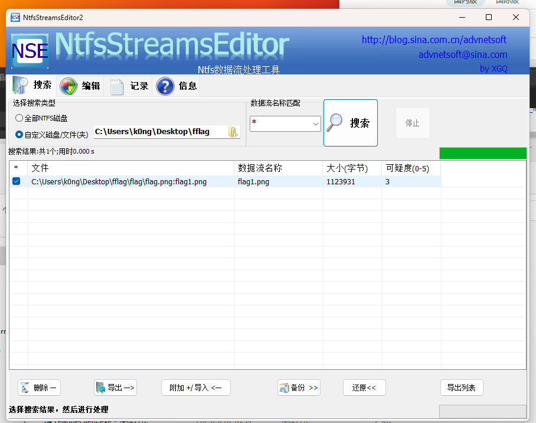
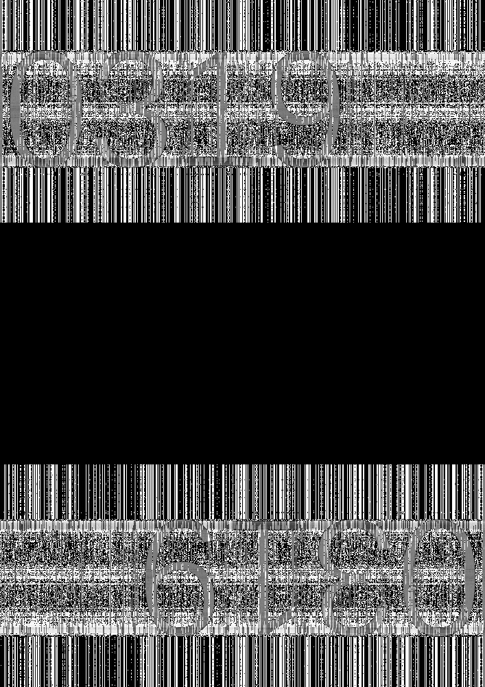

# 考点：流量分析+隐写

## 步骤

1.对1进行流量分析

1为tcp文件传输流量

搜索 flag 寻找到qq文件传输的流量包



跟踪tcp 以原始数据导出流量包

用010打开导出的流量包，选取rar数据部分另存为rar



2.对2进行流量分析

2为usb键盘鼠标流量

给出脚本

```python
#!/usr/bin/env python
# coding:utf-8
import argparse
import os
from tempfile import NamedTemporaryFile

BOOT_KEYBOARD_MAP = {
    0x00: (None, None),                         # Reserved (no event indicated)
    0x01: ('', ''),                             # ErrorRollOver
    0x02: ('', ''),                             # POSTFail
    0x03: ('', ''),                             # ErrorUndefined
    0x04: ('a', 'A'),                           # a
    0x05: ('b', 'B'),                           # b
    0x06: ('c', 'C'),                           # c
    0x07: ('d', 'D'),                           # d
    0x08: ('e', 'E'),                           # e
    0x09: ('f', 'F'),                           # f
    0x0a: ('g', 'G'),                           # g
    0x0b: ('h', 'H'),                           # h
    0x0c: ('i', 'I'),                           # i
    0x0d: ('j', 'J'),                           # j
    0x0e: ('k', 'K'),                           # k
    0x0f: ('l', 'L'),                           # l
    0x10: ('m', 'M'),                           # m
    0x11: ('n', 'N'),                           # n
    0x12: ('o', 'O'),                           # o
    0x13: ('p', 'P'),                           # p
    0x14: ('q', 'Q'),                           # q
    0x15: ('r', 'R'),                           # r
    0x16: ('s', 'S'),                           # s
    0x17: ('t', 'T'),                           # t
    0x18: ('u', 'U'),                           # u
    0x19: ('v', 'V'),                           # v
    0x1a: ('w', 'W'),                           # w
    0x1b: ('x', 'X'),                           # x
    0x1c: ('y', 'Y'),                           # y
    0x1d: ('z', 'Z'),                           # z
    0x1e: ('1', '!'),                           # 1
    0x1f: ('2', '@'),                           # 2
    0x20: ('3', '#'),                           # 3
    0x21: ('4', '$'),                           # 4
    0x22: ('5', '%'),                           # 5
    0x23: ('6', '^'),                           # 6
    0x24: ('7', '&'),                           # 7
    0x25: ('8', '*'),                           # 8
    0x26: ('9', '('),                           # 9
    0x27: ('0', ')'),                           # 0
    0x28: ('\n', '\n'),                         # Return (ENTER)
    0x29: ('[ESC]', '[ESC]'),                   # Escape
    0x2a: ('\b', '\b'),                         # Backspace
    0x2b: ('\t', '\t'),                         # Tab
    0x2c: (' ', ' '),                           # Spacebar
    0x2d: ('-', '_'),                           # -
    0x2e: ('=', '+'),                           # =
    0x2f: ('[', '{'),                           # [
    0x30: (']', '}'),                           # ]
    0x31: ('\\', '|'),                          # \
    0x32: ('', ''),                             # Non-US # and ~
    0x33: (';', ':'),                           # ;
    0x34: ('\'', '"'),                          # '
    0x35: ('`', '~'),                           # `
    0x36: (',', '<'),                           # ,
    0x37: ('.', '>'),                           # .
    0x38: ('/', '?'),                           # /
    0x39: ('[CAPSLOCK]', '[CAPSLOCK]'),         # Caps Lock
    0x3a: ('F1', 'F1'),                         # F1
    0x3b: ('F2', 'F2'),                         # F2
    0x3c: ('F3', 'F3'),                         # F3
    0x3d: ('F4', 'F4'),                         # F4
    0x3e: ('F5', 'F5'),                         # F5
    0x3f: ('F6', 'F6'),                         # F6
    0x40: ('F7', 'F7'),                         # F7
    0x41: ('F8', 'F8'),                         # F8
    0x42: ('F9', 'F9'),                         # F9
    0x43: ('F10', 'F10'),                       # F10
    0x44: ('F11', 'F11'),                       # F11
    0x45: ('F12', 'F12'),                       # F12
    0x46: ('[PRINTSCREEN]', '[PRINTSCREEN]'),   # Print Screen
    0x47: ('[SCROLLLOCK]', '[SCROLLLOCK]'),     # Scroll Lock
    0x48: ('[PAUSE]', '[PAUSE]'),               # Pause
    0x49: ('[INSERT]', '[INSERT]'),             # Insert
    0x4a: ('[HOME]', '[HOME]'),                 # Home
    0x4b: ('[PAGEUP]', '[PAGEUP]'),             # Page Up
    0x4c: ('[DELETE]', '[DELETE]'),             # Delete Forward
    0x4d: ('[END]', '[END]'),                   # End
    0x4e: ('[PAGEDOWN]', '[PAGEDOWN]'),         # Page Down
    0x4f: ('[RIGHTARROW]', '[RIGHTARROW]'),     # Right Arrow
    0x50: ('[LEFTARROW]', '[LEFTARROW]'),       # Left Arrow
    0x51: ('[DOWNARROW]', '[DOWNARROW]'),       # Down Arrow
    0x52: ('[UPARROW]', '[UPARROW]'),           # Up Arrow
    0x53: ('[NUMLOCK]', '[NUMLOCK]'),           # Num Lock
    0x54: ('[KEYPADSLASH]', '/'),               # Keypad /
    0x55: ('[KEYPADASTERISK]', '*'),            # Keypad *
}

def parse_boot_keyboard_report(data: bytearray):
    # 数据解析
    modifiers = data[0]  # 修改键字节
    keys = data[2:8]      # 键码字节

    # 将修改键字节中的位解码为按键修饰符
    ctrl = (modifiers & 0x11) != 0
    shift = (modifiers & 0x22) != 0
    alt = (modifiers & 0x44) != 0
    gui = (modifiers & 0x88) != 0

    # 解析键码字节并将其映射为字符
    characters = []
    for key in keys:
        if key != 0:
            # 键码不为0则查询映射表
            if key in BOOT_KEYBOARD_MAP:
                characters.append(BOOT_KEYBOARD_MAP[key][shift])
            else:
                characters.append(None)
    return (ctrl, shift, alt, gui, characters)

def help_formatter(prog):
    return argparse.HelpFormatter(prog, max_help_position=40)

def main():
    # 解析命令行参数
    parser = argparse.ArgumentParser(
        description='Parse keyboard report data and output as text', formatter_class=help_formatter)
    parser.add_argument('pcapng_file', help='path to the pcapng file')
    args = parser.parse_args()

    # 通过tshark解析pcapng文件，获取键盘数据包
    tmpfile = NamedTemporaryFile(delete=False)
    tmpfile.close()

    command = "tshark -r %s -T fields -e usbhid.data -e usb.capdata > %s" % (
        args.pcapng_file, tmpfile.name)
    os.system(command)

    with open(tmpfile.name, 'r') as f:
        lines = f.readlines()

    os.unlink(tmpfile.name)

    # 解析键盘数据包，获取输入字符
    text = ""
    for line in lines:
        capdata = line.strip().replace(':', '')
        if capdata:
            data = bytearray.fromhex(capdata)
            characters = parse_boot_keyboard_report(data)[-1]
            for character in characters:
                if character:
                    text += character
        else:
            pass

    print(f'Text output:\n{text}')

if __name__ == "__main__":
    main()
``` 

在tshark目录下进行

```cmd
python test.py 2.pcapng
```

可以在输出中找到rar密码



密码：zhejiangnormal

3.使用rar进行解压后得到flag文件夹

使用工具ntfsstreamseditor.exe检测flag文件夹，发现ntfs流隐藏，导出隐藏的文件为png



4.同时在flag文件夹中也能找到一张相似的图片，显然为盲水印

给出脚本：

```python
#!/usr/bin/env python
# -*- coding: utf8 -*-

import sys
import random

cmd = None
debug = False
seed = 20160930
oldseed = False
alpha = 3.0

if __name__ == '__main__':
    if '-h' in sys.argv or '--help' in sys.argv or len(sys.argv) < 2:
        print ('Usage: python bwm.py <cmd> [arg...] [opts...]')
        print ('  cmds:')
        print ('    encode <image> <watermark> <image(encoded)>')
        print ('           image + watermark -> image(encoded)')
        print ('    decode <image> <image(encoded)> <watermark>')
        print ('           image + image(encoded) -> watermark')
        print ('  opts:')
        print ('    --debug,          Show debug')
        print ('    --seed <int>,     Manual setting random seed (default is 20160930)')
        print ('    --oldseed         Use python2 random algorithm.')
        print ('    --alpha <float>,  Manual setting alpha (default is 3.0)')
        sys.exit(1)
    cmd = sys.argv[1]
    if cmd != 'encode' and cmd != 'decode':
        print ('Wrong cmd %s' % cmd)
        sys.exit(1)
    if '--debug' in sys.argv:
        debug = True
        del sys.argv[sys.argv.index('--debug')]
    if '--seed' in sys.argv:
        p = sys.argv.index('--seed')
        if len(sys.argv) <= p+1:
            print ('Missing <int> for --seed')
            sys.exit(1)
        seed = int(sys.argv[p+1])
        del sys.argv[p+1]
        del sys.argv[p]
    if '--oldseed' in sys.argv:
        oldseed = True
        del sys.argv[sys.argv.index('--oldseed')]
    if '--alpha' in sys.argv:
        p = sys.argv.index('--alpha')
        if len(sys.argv) <= p+1:
            print ('Missing <float> for --alpha')
            sys.exit(1)
        alpha = float(sys.argv[p+1])
        del sys.argv[p+1]
        del sys.argv[p]
    if len(sys.argv) < 5:
        print ('Missing arg...')
        sys.exit(1)
    fn1 = sys.argv[2]
    fn2 = sys.argv[3]
    fn3 = sys.argv[4]

import cv2
import numpy as np
import matplotlib.pyplot as plt

# OpenCV是以(BGR)的顺序存储图像数据的
# 而Matplotlib是以(RGB)的顺序显示图像的
def bgr_to_rgb(img):
    b, g, r = cv2.split(img)
    return cv2.merge([r, g, b])

if cmd == 'encode':
    print ('image<%s> + watermark<%s> -> image(encoded)<%s>' % (fn1, fn2, fn3))
    img = cv2.imread(fn1)
    wm = cv2.imread(fn2)

    if debug:
        plt.subplot(231), plt.imshow(bgr_to_rgb(img)), plt.title('image')
        plt.xticks([]), plt.yticks([])
        plt.subplot(234), plt.imshow(bgr_to_rgb(wm)), plt.title('watermark')
        plt.xticks([]), plt.yticks([])

    # print img.shape # 高, 宽, 通道
    h, w = img.shape[0], img.shape[1]
    hwm = np.zeros((int(h * 0.5), w, img.shape[2]))
    assert hwm.shape[0] > wm.shape[0]
    assert hwm.shape[1] > wm.shape[1]
    hwm2 = np.copy(hwm)
    for i in range(wm.shape[0]):
        for j in range(wm.shape[1]):
            hwm2[i][j] = wm[i][j]

    if oldseed: random.seed(seed,version=1)
    else: random.seed(seed)
    m, n = list(range(hwm.shape[0])), list(range(hwm.shape[1]))
    if oldseed:
        random.shuffle(m,random=random.random)
        random.shuffle(n,random=random.random)
    else:
        random.shuffle(m)
        random.shuffle(n)

    for i in range(hwm.shape[0]):
        for j in range(hwm.shape[1]):
            hwm[i][j] = hwm2[m[i]][n[j]]

    rwm = np.zeros(img.shape)
    for i in range(hwm.shape[0]):
        for j in range(hwm.shape[1]):
            rwm[i][j] = hwm[i][j]
            rwm[rwm.shape[0] - i - 1][rwm.shape[1] - j - 1] = hwm[i][j]

    if debug:
        plt.subplot(235), plt.imshow(bgr_to_rgb(rwm)), \
            plt.title('encrypted(watermark)')
        plt.xticks([]), plt.yticks([])

    f1 = np.fft.fft2(img)
    f2 = f1 + alpha * rwm
    _img = np.fft.ifft2(f2)

    if debug:
        plt.subplot(232), plt.imshow(bgr_to_rgb(np.real(f1))), \
            plt.title('fft(image)')
        plt.xticks([]), plt.yticks([])

    img_wm = np.real(_img)

    assert cv2.imwrite(fn3, img_wm, [int(cv2.IMWRITE_JPEG_QUALITY), 100])

    # 这里计算下保存前后的(溢出)误差
    img_wm2 = cv2.imread(fn3)
    sum = 0
    for i in range(img_wm.shape[0]):
        for j in range(img_wm.shape[1]):
            for k in range(img_wm.shape[2]):
                sum += np.power(img_wm[i][j][k] - img_wm2[i][j][k], 2)
    miss = np.sqrt(sum) / (img_wm.shape[0] * img_wm.shape[1] * img_wm.shape[2]) * 100
    print ('Miss %s%% in save' % miss)

    if debug:
        plt.subplot(233), plt.imshow(bgr_to_rgb(np.uint8(img_wm))), \
            plt.title('image(encoded)')
        plt.xticks([]), plt.yticks([])

    f2 = np.fft.fft2(img_wm)
    rwm = (f2 - f1) / alpha
    rwm = np.real(rwm)

    wm = np.zeros(rwm.shape)
    for i in range(int(rwm.shape[0] * 0.5)):
        for j in range(rwm.shape[1]):
            wm[m[i]][n[j]] = np.uint8(rwm[i][j])
    for i in range(int(rwm.shape[0] * 0.5)):
        for j in range(rwm.shape[1]):
            wm[rwm.shape[0] - i - 1][rwm.shape[1] - j - 1] = wm[i][j]

    if debug:
        assert cv2.imwrite('_bwm.debug.wm.jpg', wm)
        plt.subplot(236), plt.imshow(bgr_to_rgb(wm)), plt.title(u'watermark')
        plt.xticks([]), plt.yticks([])

    if debug:
        plt.show()

elif cmd == 'decode':
    print ('image<%s> + image(encoded)<%s> -> watermark<%s>' % (fn1, fn2, fn3))
    img = cv2.imread(fn1)
    img_wm = cv2.imread(fn2)

    if debug:
        plt.subplot(231), plt.imshow(bgr_to_rgb(img)), plt.title('image')
        plt.xticks([]), plt.yticks([])
        plt.subplot(234), plt.imshow(bgr_to_rgb(img_wm)), plt.title('image(encoded)')
        plt.xticks([]), plt.yticks([])

    if oldseed: random.seed(seed,version=1)
    else: random.seed(seed)
    m, n = list(range(int(img.shape[0] * 0.5))), list(range(img.shape[1]))
    if oldseed:
        random.shuffle(m,random=random.random)
        random.shuffle(n,random=random.random)
    else:
        random.shuffle(m)
        random.shuffle(n)

    f1 = np.fft.fft2(img)
    f2 = np.fft.fft2(img_wm)

    if debug:
        plt.subplot(232), plt.imshow(bgr_to_rgb(np.real(f1))), \
            plt.title('fft(image)')
        plt.xticks([]), plt.yticks([])
        plt.subplot(235), plt.imshow(bgr_to_rgb(np.real(f1))), \
            plt.title('fft(image(encoded))')
        plt.xticks([]), plt.yticks([])

    rwm = (f2 - f1) / alpha
    rwm = np.real(rwm)

    if debug:
        plt.subplot(233), plt.imshow(bgr_to_rgb(rwm)), \
            plt.title('encrypted(watermark)')
        plt.xticks([]), plt.yticks([])

    wm = np.zeros(rwm.shape)
    for i in range(int(rwm.shape[0] * 0.5)):
        for j in range(rwm.shape[1]):
            wm[m[i]][n[j]] = np.uint8(rwm[i][j])
    for i in range(int(rwm.shape[0] * 0.5)):
        for j in range(rwm.shape[1]):
            wm[rwm.shape[0] - i - 1][rwm.shape[1] - j - 1] = wm[i][j]
    assert cv2.imwrite(fn3, wm)

    if debug:
        plt.subplot(236), plt.imshow(bgr_to_rgb(wm)), plt.title(u'watermark')
        plt.xticks([]), plt.yticks([])

    if debug:
        plt.show()
```



获得密码：0319

5.结合flag.txt中的
Q3EEu5kN84rv2yXPUMRA+TPoYplwmPb3uR/ggiiDcr+T+Ut7I4bXEg==
不难想到rc4加密
使用密码0319解码后得
empudWN0ZntUaDFzX2k4XzdoRV9FbmRfTTFzY30=
再进行base64解码后得到flag
zjnuctf{Th1s_i8_7hE_End_M1sc}
