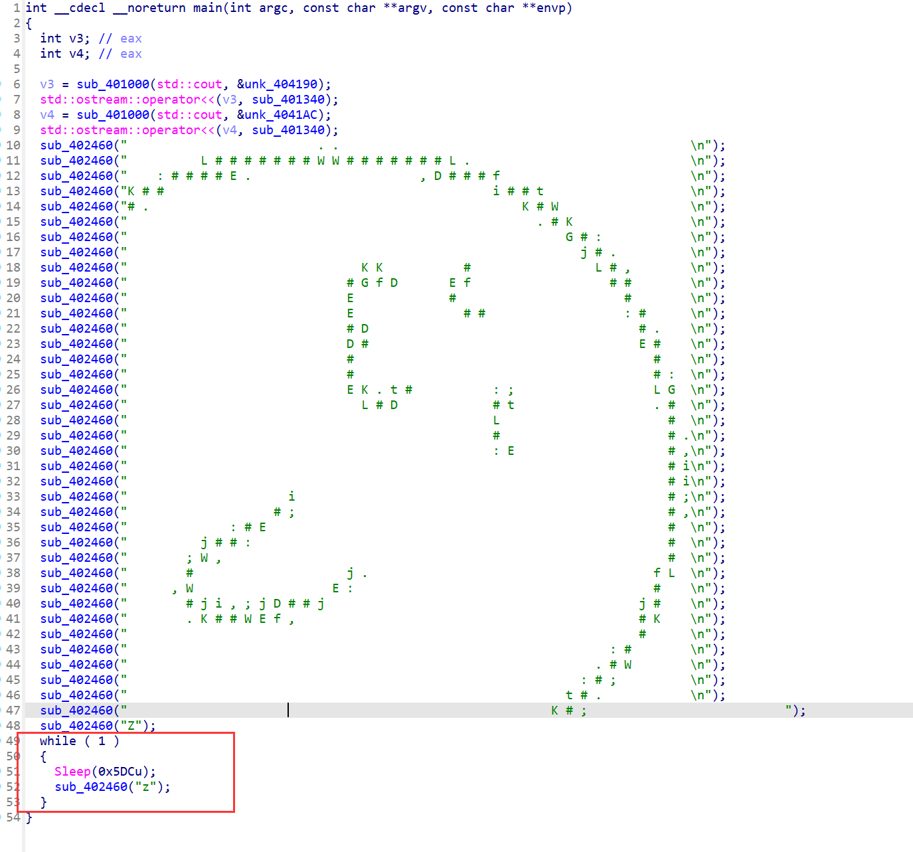
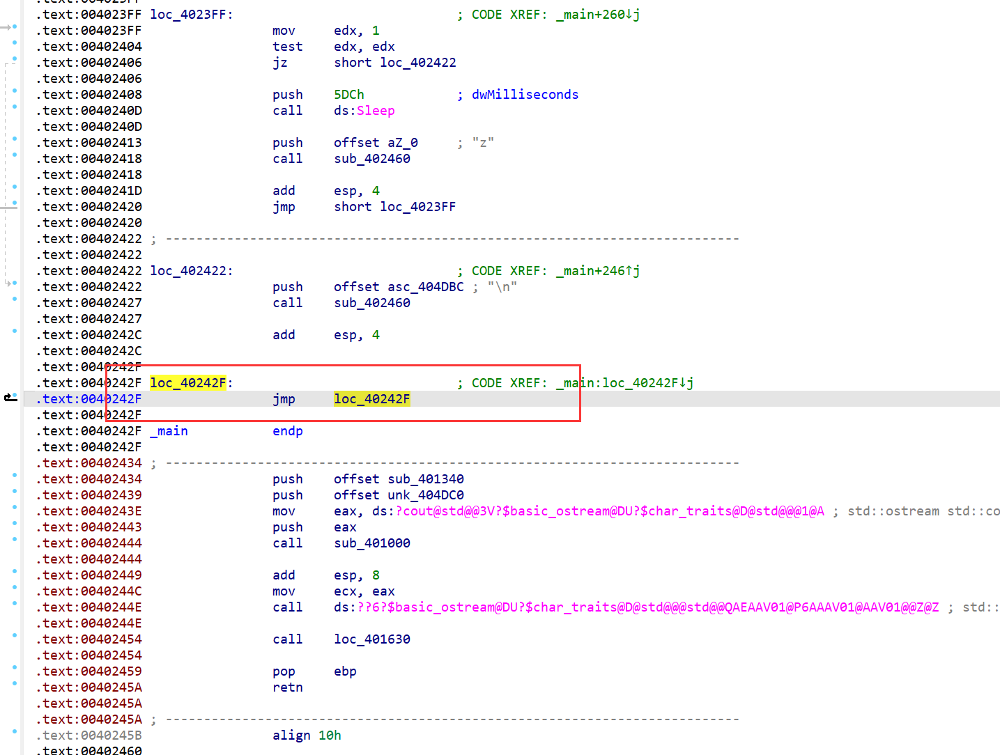
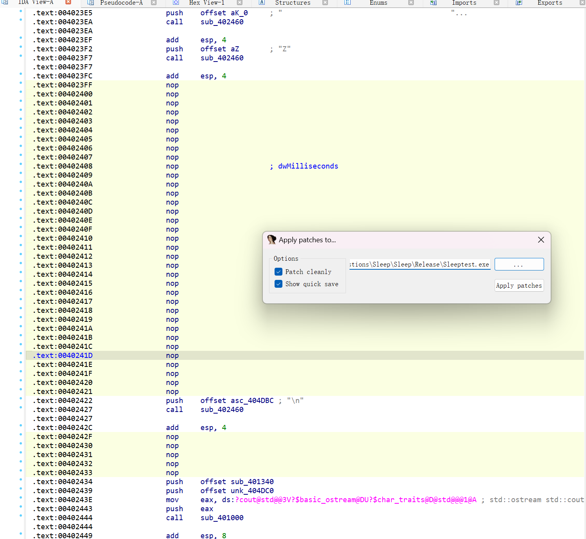
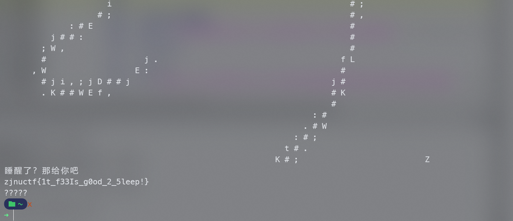

### Sleep

这题因为是一个简单题，就不考察什么加密算法啥的了，考察一手程序的patch好了。（去年安卓base64惨痛教训）

程序加了个upx 4.0.2最新版的壳，啥都没改，直接upx -d就行了

main函数一个字符画，下面可以看得出来是一个while死循环，一直输出z

看起来程序到这里就结束了，实际上如果你按照题目意思来，想到patch程序就能发现问题了，准备patch的时候直接发现这里还有依托东西，其实这个也是个死循环，只有一行汇编，ida识别到这里程序就不往下执行了下面那一坨就报红了

那这题直接把两个死循环nop掉就行了，应用patch再运行即可

