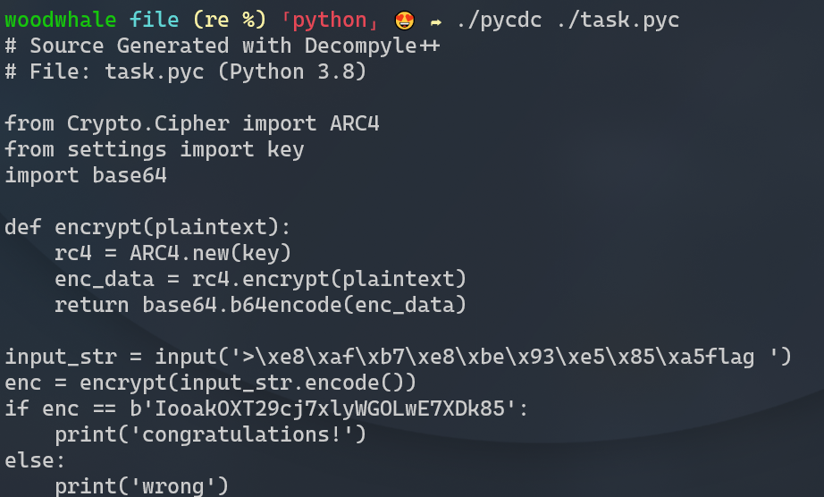

# easy_py

## 前言

本wp由验题人woodwhale编写，出题人yjp的wp请查看pdf版本

## 解题思路

首先看到携带py图标的exe，想到是用pyinstaller打包的文件

可以使用`pyinstxtractor`提取pyc文件

[extremecoders-re/pyinstxtractor: PyInstaller Extractor (github.com)](https://github.com/extremecoders-re/pyinstxtractor)

发现python版本是py3.8。这里一定要用相同版本的python进行pyinstxtractor提取，若使用不同版本的python进行文件提取，会造成无法提取python程序导入的包

进入`task.exe_extracted`中找到task.pyc

于是使用pycdc进行pyc文件的反编译

发现有一句`from settings import key`

那么需要找到这个setting的信息，进入`PYZ-00.pyz_extracted`找到`setting.pyc`，然后使用pycdc反编译

找到key

因为是rc4解密，所以直接使用cyber进行解密

