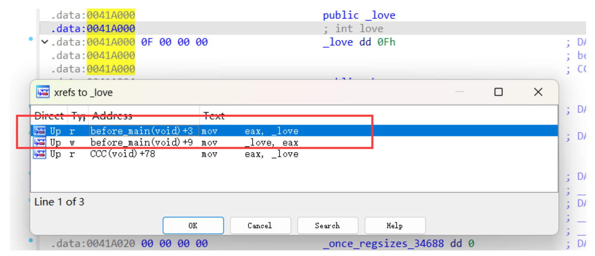

### 考点

before_main + tea + 优化过程

### 解题步骤

第一关就是简单的tea，但做不做都无所谓。

第二关是简单异或，但是注意love被改了



ctrl + x可以看到

s1.py

```
data = b'zecdObe~'
love = 14
for t in data:
    print(chr(t^(2+love)),end="")
```

第三关是Gift直接把结果跑出来就行


```
__int64 __cdecl gift(int n)
{
  __int64 v2; // rax

  if ( (unsigned int)n <= 1 )
    return 2LL;
  v2 = gift(n - 1);
  return v2 + gift(n - 2);
}
```

```python
import ctypes
def calculateFibonacci(index):
    n = [2, 2]
    if index <= 1:
        return 2
    i, j = 0, 1
    for _ in range(1, index):
        n[i] = n[i] + n[j]
        i, j = j, i
    return n[j]
print(calculateFibonacci(114))
print(ctypes.c_uint64(calculateFibonacci(114)).value)
# 966325905224020326569770
# 11663666819174717226
```

